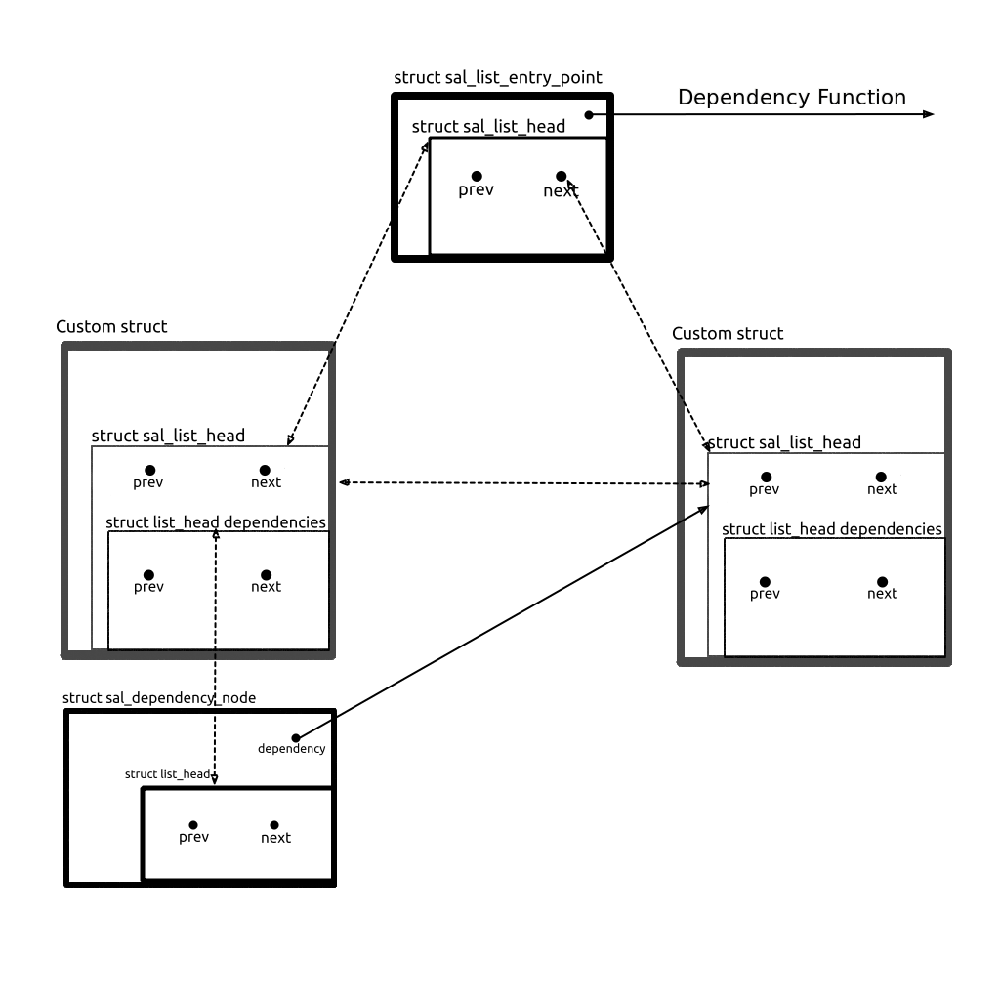

# Generic Self-Adjusting List with Dependencies
## General overview of the data structure

## Description of the internal structures
### Glossary
- entry: always refers to a custom struct
- node: always refers to the struct sal_head within an entry
- access: always refers to the start and control structure of the list, which contains the dependency function and a pointer to the first and last element of the list

### struct sal_access
This structure is the start of the list. It needs to be created first. It contains a function pointer to the function 
which calculates if there is a dependency between two nodes.
It also contains a `struct sal_head` which holds a next and a previous pointer to the first and the last element of the 
list. Initially both pointers point to itself.
It also contains a list structure for dependencies. This list is never used for the `sal_access`, but left in there
so that it is easier to loop over the entire list.(overhead of 2 * sizeof( pointers ) )

### struct sal_head
As already mentioned: This structure holds 2 `struct sal_head` pointers for the next and the previous element in the 
list as well as a `struct list_head`, which is a double linked list in the linux kernel, which is used to store 
`struct sal_dependency_node`s.

### struct sal_dependency_node
This structure is used to store the dependencies of an item in the list. It holds a pointer to the item where a 
dependency has been detected and the `struct list_head` which links the `struct sal_dependency_node`s together.
The memory of this structure is allocated after a new item has been added to the Self-Adjusting list and a dependency 
between the new node and another item in the list has been detected. The memory is freed when the item is removed from 
the list.
