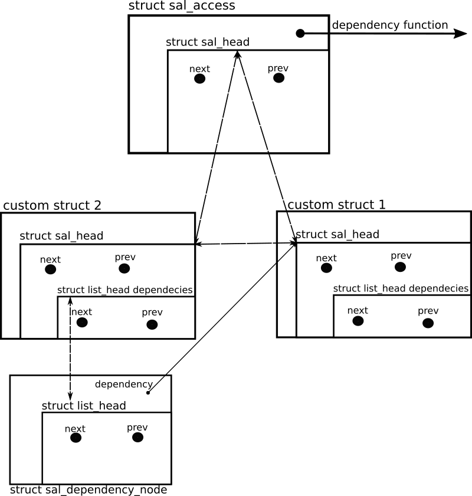
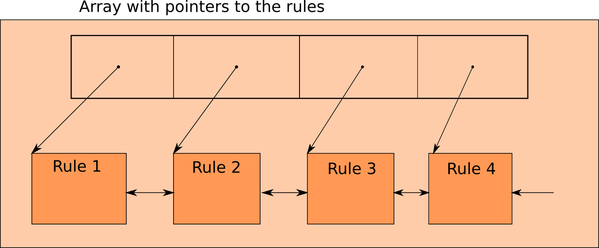
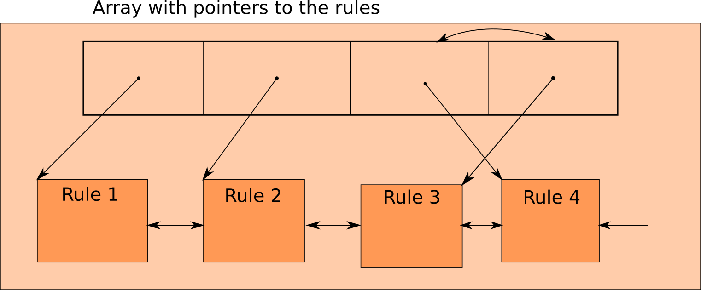

# Generic Self-Adjusting List with Dependencies
## First Algorithm: Memoryless
This approach makes use of the generic list already provided by the Linux Kernel. Only the access function
is added which re-orders the elements in the list after an entry is accessed. The list_access funtion takes
2 `list_head *` and the compare/dependency calculation function as a parameter. The element which is accessed is checked, 
if it has a dependency to its predecessor. If no dependency is detected then the accessed element is swapped with its 
predecessor. However, if a dependency is detected the predecessor is the "active" node and is checked for dependenies with
its predecessors. This process repeats until the head of the list is reached. This is done iteratively and not recursively,
since the optimization of a tail recursion is not done with the default compile parameters.

## Second Algorithm: Storing the Dependency Graph in Memory
### General overview of the data structure


### Description of the internal structures
#### Glossary
- entry: always refers to a custom struct
- node: always refers to the struct sal_head within an entry
- access: always refers to the start and control structure of the list, which contains the dependency function and a pointer to the first and last element of the list

#### struct sal_access
This structure is the start of the list. It needs to be created first. It contains a function pointer to the function 
which calculates if there is a dependency between two nodes.
It also contains a `struct sal_head` which holds a next and a previous pointer to the first and the last element of the 
list. Initially both pointers point to itself.
It also contains a list structure for dependencies. This list is never used for the `sal_access`, but left in there
so that it is easier to loop over the entire list.(overhead of 2 * sizeof( pointers ) )

#### struct sal_head
As already mentioned: This structure holds 2 `struct sal_head` pointers for the next and the previous element in the 
list as well as a `struct list_head`, which is a doubly linked list in the Linux Kernel, which is used to store 
`struct sal_dependency_node`s.

#### struct sal_dependency_node
This structure is used to store the dependencies of an item in the list. It holds a pointer to the item where a 
dependency has been detected and the `struct list_head` which links the `struct sal_dependency_node`s together.
The memory of this structure is allocated after a new item has been added to the Self-Adjusting list and a dependency 
between the new node and another item in the list has been detected. The memory is freed when the item is removed from 
the list.


# nf_tables firewall rule evaluation
A rule is represented as struct nft_rule:
```c
struct nft_rule {
	struct list_head		list;
	u64				handle:42,
					genmask:2,
					dlen:12,
					udata:1;
	unsigned char			data[]
		__attribute__((aligned(__alignof__(struct nft_expr))));
};
```

Because the frontend tool nft which is used to add new rules to the list, does not support priorities for nft_rules and 
that there is no field in the struct either, the handle attribute could be used to act as the priority.
The handle attribute is acting like an id for every rule. It is increased automatically when a rule is added.
That means that only rules with lower priority (higher handle number) can be added to the list. Therefore, the initial 
order of rules, so the order in which rules are added to the list, has to be in the format of decreasing priorities.
Priorities cannot be changed afterwards.

Rules are evaluated in the `nft_do_chain` function.
Every chain contains an array of pointers called rules, which points to the struct nft_rule elements in the list.

The rules are evaluated by iterating over this array.
```c
unsigned int nft_do_chain(struct nft_pktinfo *pkt, void *priv)
{
    ...
    struct nft_rule *rules = chain->rules;
    ...
    struct nft_rule *rule = *rules;
    for(;*rules; rules++){
        //Evaluation of rules, break out of loop if a rule matched the packet
    }
    // insert MRF algorithm on rule
    // rule points to the element that has been accessed
    // move rule in the chain->rules array forward
    // original list is not changed

    return verdict_code; // ACCEPT, DROP, etc.
}
```
